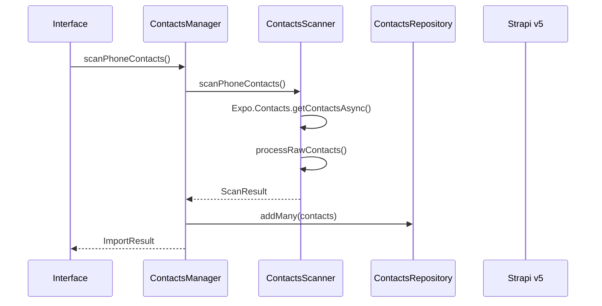
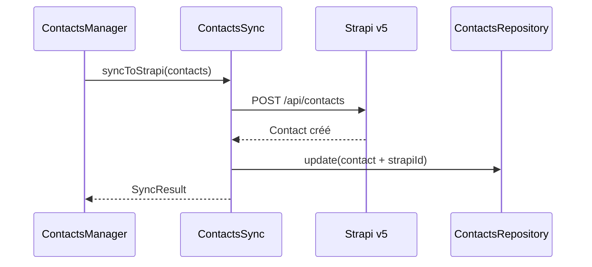
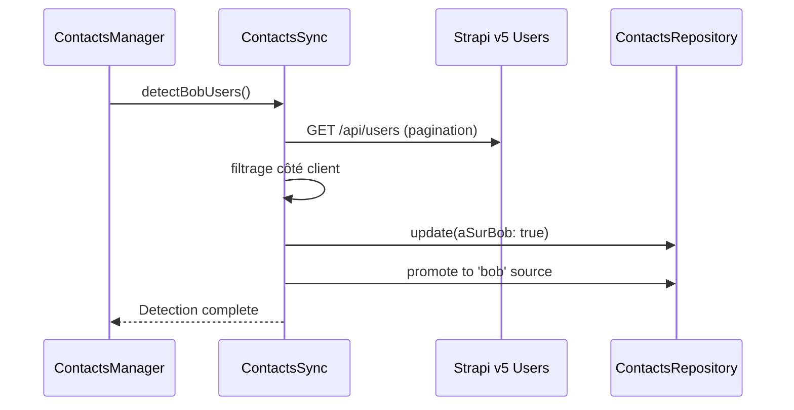

# 📱 Système de Contacts Bob - Documentation Strapi v5

## 🎯 Vue d'ensemble

Le système de contacts Bob gère l'intégration complète entre les contacts téléphone, le répertoire local et Strapi v5 pour détecter et gérer les utilisateurs Bob.

## 📊 Architecture Unifiée

```
📱 Téléphone → 🔄 Scanner → 📥 Import → 🔗 Strapi v5 → 👥 Détection Bob
      ↓              ↓           ↓           ↓             ↓
   Contacts      Repository   Sync API   Users API    Promotion
```

## 🏗️ Structure des Services

### 1. ContactsManager (Service Central)
**Fichier**: `src/services/contacts/ContactsManager.ts`

**Responsabilités**:
- Orchestration de toutes les opérations
- Interface unique pour tous les composants
- Gestion des états et cache

**Méthodes principales**:
```typescript
// Scan du téléphone
async scanPhoneContacts(): Promise<ScanResult>

// Import dans le répertoire
async importContactsToRepertoire(identifiers: string[]): Promise<ImportResult>

// Synchronisation Strapi v5
async syncToStrapi(contacts?: Contact[]): Promise<SyncResult>

// Détection utilisateurs Bob
async detectBobUsers(contacts?: Contact[]): Promise<void>

// Suppression
async deleteAllFromStrapi(): Promise<number>

// Nettoyage
async clearAllData(): Promise<void>
```

### 2. ContactsScanner (Scan Téléphone)
**Fichier**: `src/services/contacts/ContactsScanner.ts`

**Responsabilités**:
- Scan du répertoire téléphone via Expo Contacts
- Normalisation des numéros de téléphone
- Filtrage et validation des contacts

**Format de sortie**:
```typescript
interface ScanResult {
  contacts: Contact[];
  total: number;
  hasPermission: boolean;
  errors: string[];
}
```

### 3. ContactsSync (Synchronisation Strapi v5)
**Fichier**: `src/services/contacts/ContactsSync.ts`

**Responsabilités**:
- Synchronisation bidirectionnelle avec Strapi v5
- Création/mise à jour des contacts
- Détection des utilisateurs Bob via API

**Endpoints Strapi v5 utilisés**:
```typescript
// Contacts
POST   /api/contacts          // Création
GET    /api/contacts          // Liste
PUT    /api/contacts/{id}     // Mise à jour
DELETE /api/contacts/{id}     // Suppression

// Utilisateurs Bob
GET    /api/users             // Détection Bob
```

### 4. ContactsRepository (Cache Local)
**Fichier**: `src/services/contacts/ContactsRepository.ts`

**Responsabilités**:
- Stockage local AsyncStorage
- Cache en mémoire optimisé
- Notifications de changements
- Statistiques temps réel

## 📋 Types de Contacts

### Sources de contacts
```typescript
type ContactSource = 'phone' | 'repertoire' | 'bob' | 'invited';

// phone: Contact scanné du téléphone
// repertoire: Contact importé dans le répertoire Bob
// bob: Utilisateur confirmé sur Bob (détecté)
// invited: Contact invité sur Bob
```

### Structure Contact Unifiée
```typescript
interface Contact {
  // Identifiants
  id: string;                    // ID local unique
  telephone: string;             // Numéro normalisé (+33...)
  
  // Informations de base
  nom: string;
  prenom?: string;
  email?: string;
  
  // Métadonnées
  source: ContactSource;
  dateAjout: string;
  dateImport?: string;
  
  // Intégration Strapi v5
  strapiId?: string;            // ID dans Strapi
  documentId?: string;          // Document ID Strapi v5
  
  // État Bob
  aSurBob?: boolean;            // A un compte Bob
  statut?: 'ami' | 'invite' | 'prospect';
  
  // Invitations
  invitation?: {
    id: string;
    statut: string;
    dateEnvoi: string;
    type: 'sms' | 'email';
  };
}
```

## 🔄 Flux de Données

### 1. Scan et Import


### 2. Synchronisation Strapi v5


### 3. Détection Bob


## 🗑️ Problème Suppression Strapi v5

### Problème Identifié
Les suppressions échouent avec 404 car l'ID utilisé ne correspond pas au format Strapi v5.

### Diagnostic
```bash
# ID utilisé pour suppression
UUID: 1A5B7166-FD8A-457F-9A5A-9D1620EC5592

# Résultat
DELETE /api/contacts/1A5B7166-FD8A-457F-9A5A-9D1620EC5592 → 404
```

### Solutions à Tester

1. **Vérifier format ID Strapi v5**:
```typescript
// Tester si utiliser documentId ou id numérique
DELETE /api/contacts/{documentId}  vs  DELETE /api/contacts/{id}
```

2. **Adapter la suppression**:
```typescript
// Dans useContactsActions.ts
const strapiIdToUse = contact.documentId || contact.strapiId || contact.id;
```

3. **Test API requis**:
   - Utiliser bouton "Test API Contacts Strapi v5"
   - Voir structure exacte des contacts
   - Identifier bon format d'ID

## 📊 Configuration Strapi v5

### Endpoints Confirmés
```typescript
const API_BASE_URL = 'http://46.202.153.43:1337/api';

// Contacts
GET    /api/contacts?pagination[limit]=100
POST   /api/contacts
DELETE /api/contacts/{id}  // ⚠️ Format ID à vérifier

// Users (détection Bob)
GET    /api/users?pagination[limit]=100
```

### Authentification
```typescript
headers: {
  'Authorization': `Bearer ${token}`,
  'Content-Type': 'application/json'
}
```

## 🔧 Actions Requises

### Immédiat
1. **Tester API Strapi v5** - Voir structure contacts
2. **Corriger suppression** - Adapter format ID
3. **Vérifier sync** - S'assurer compatibilité v5

### Optimisations
1. **Pagination optimisée** - Gérer gros volumes
2. **Cache intelligent** - Réduire appels API
3. **Gestion erreurs** - Robustesse réseau

## 🧪 Tests de Validation

### Test 1: Structure API
```bash
# Via bouton "Test API Contacts Strapi v5"
→ Voir format exact des contacts
→ Identifier champs ID disponibles
```

### Test 2: Suppression
```bash
# Supprimer contact test
→ Voir ID utilisé dans logs
→ Vérifier si supprimé de Strapi
```

### Test 3: Détection Bob
```bash
# Via bouton "Détecter utilisateurs Bob" 
→ Vérifier logique côté client
→ Confirmer promotion contacts
```

## 📈 Métriques Système

### Performances Actuelles
- **Scan téléphone**: ~1261 contacts en <2s
- **Détection Bob**: 16 utilisateurs, 5 répertoire
- **Cache**: 1264 contacts en mémoire
- **Stats temps réel**: Mise à jour automatique

### Optimisations v5
- **Pagination**: 100 items/page
- **Cache local**: AsyncStorage persistant  
- **Filtrage client**: Contourne limitations API
- **Sync différée**: Évite conflits opérations

---

## 🔍 Debug et Monitoring

### Logs Clés
```typescript
console.log('📱 Scan téléphone:', scanResult);
console.log('🔄 Sync Strapi:', syncResult);
console.log('🎯 Détection Bob:', detectionResult);
console.log('🗑️ Suppression:', deleteResult);
```

### Métriques Importantes
- Taux de synchronisation Strapi
- Nombre d'utilisateurs Bob détectés
- Performance cache local
- Erreurs API Strapi v5

Cette architecture garantit une intégration robuste avec Strapi v5 tout en maintenant les performances et la fiabilité du système de contacts Bob.