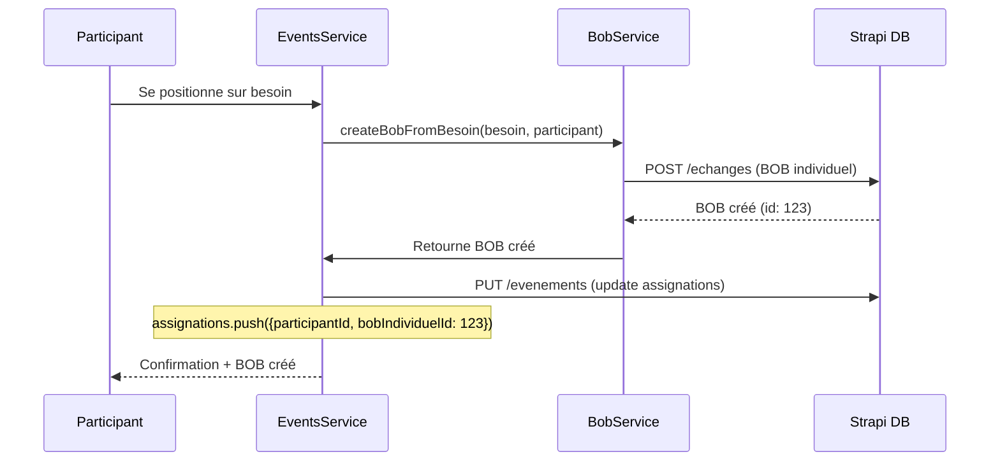

# Logique Métier Bob - Écosystème Unifié d'Entraide

## Vue d'ensemble

Bob est un **écosystème d'entraide unifié** qui repose sur un principe fondamental : **tout converge vers la création de BOB individuels**. Que ce soit via une demande directe ou via la participation à un événement, le résultat final est toujours le même : faciliter l'entraide entre personnes de confiance.

## Architecture Conceptuelle

### Principe Fondamental
```
TOUTE FORME D'ENTRAIDE → BOB INDIVIDUEL → ÉCHANGE RÉEL
```

### Deux Points d'Entrée, Un Même Résultat

#### 1. **BOB Individuel Direct** (Approche Micro)
- **Utilisateur A** exprime un besoin : "Je cherche une perceuse"
- **Utilisateur B** voit la demande et peut aider
- **Résultat** : BOB individuel créé entre A et B

#### 2. **Événement Collectif** (Approche Macro) 
- **Organisateur** crée un événement : "Barbecue de quartier"
- **Besoins définis** : "Besoin d'une perceuse", "Besoin de boissons", etc.
- **Participant** se positionne sur "Besoin d'une perceuse"
- **Résultat** : BOB individuel créé automatiquement (même structure !)

## Modèle de Données Unifié

### Structure Core : Le BOB Individuel

```typescript
interface BobIndividuel {
  id: number;
  titre: string;
  description: string;
  type: 'pret' | 'emprunt' | 'service_offert' | 'service_demande';
  
  // Participants
  createur: User;        // Celui qui demande/propose
  assignee?: User;       // Celui qui accepte d'aider
  
  // Contexte d'origine  
  origine: 'direct' | 'evenement';
  evenementId?: number;  // Si issu d'un événement
  
  // Lifecycle
  statut: 'actif' | 'en_cours' | 'termine' | 'annule';
  dateCreation: string;
  bobizGagnes: number;
}
```

### Événements = Orchestrateur de BOB

```typescript
interface Evenement {
  id: number;
  titre: string;
  description: string;
  organisateur: User;
  
  // Les "besoins" sont des templates de BOB
  besoins: BesoinEvenement[];
  
  // Tracking des BOB créés depuis cet événement
  metadata: {
    bobsIndividuelsCreés: number[];  // IDs des BOB créés
  }
}

interface BesoinEvenement {
  id: string;
  titre: string;          // → Devient le titre du BOB
  description: string;    // → Devient la description du BOB
  type: 'objet' | 'service_individuel' | 'service_collectif';
  
  // Assignations = Participants positionnés
  assignations: {
    participantId: number;
    bobIndividuelId: number;  // 🔗 Lien vers le BOB créé !
    dateAssignation: string;
  }[];
}
```

## Flux de Transformation

### Positionnement sur Besoin → Création BOB



### Logique de Type Mapping

```typescript
const mapBesoinToBobType = (besoinType: string): string => {
  switch (besoinType) {
    case 'objet': 
      return 'pret';  // Participant propose de prêter
    
    case 'service_individuel':
    case 'service_collectif':
    case 'service_timing':
      return 'service_offert';  // Participant propose le service
      
    default: 
      return 'service_offert';
  }
};
```

## Synchronisation Strapi

### Collections Strapi Requises

#### 1. **Collection `echanges`** (BOB Individuels)
```json
{
  "titre": "String required",
  "description": "Text",
  "type": "Enumeration [pret,emprunt,service_offert,service_demande]",
  "bobizGagnes": "Number",
  "statut": "Enumeration [actif,en_cours,termine,annule]",
  
  // Relations
  "createur": "Relation to User",
  "demandeur": "Relation to User", 
  
  // Contexte événement
  "origine": "Enumeration [direct,evenement]",
  "evenement": "Relation to Evenement (optional)"
}
```

#### 2. **Collection `evenements`**
```json
{
  "titre": "String required",
  "description": "Text", 
  "dateDebut": "DateTime",
  "lieu": "JSON",
  "organisateur": "Relation to User",
  "statut": "Enumeration [planifie,en_cours,termine,annule]",
  
  // Métadonnées avec besoins
  "metadata": "JSON {
    besoins: BesoinEvenement[],
    bobsIndividuelsCreés: number[],
    ciblage: {...}
  }"
}
```

#### 3. **API Routes Nécessaires**

```typescript
// Dans EventsService
POST /evenements/{id}/besoins/{besoinId}/position
→ Crée BOB individuel automatiquement
→ Met à jour les assignations du besoin

GET /evenements/{id}/bobs
→ Retourne tous les BOB créés depuis cet événement

PUT /echanges/{bobId}/complete
→ Marque le BOB comme terminé
→ Met à jour le statut du besoin correspondant si applicable
```

## Règles Métier Essentielles

### 1. **Cohérence Bidirectionnelle**
- Quand un BOB issu d'événement change de statut → Le besoin correspondant est mis à jour
- Quand un participant annule sa position → Le BOB est annulé et le besoin redevient ouvert

### 2. **Traçabilité Complète** 
- Chaque BOB conserve sa référence d'origine (direct vs événement)
- Les événements trackent tous les BOB générés
- Les utilisateurs voient l'historique complet

### 3. **BOBIZ Cohérents**
- BOB direct : BOBIZ définis par le créateur
- BOB d'événement : BOBIZ calculés selon complexité du besoin
- Redistribution possible selon participation événement

### 4. **Permissions et Visibilité**
```typescript
// BOB Direct
visible_par: [createur, assignee, contacts_communs]

// BOB d'Événement  
visible_par: [tous_participants_evenement, organisateur]
```

## Flux Utilisateur Unifié

### Parcours A : Création BOB Direct
```
HomeScreen → "Créer un BOB" → CreateExchangeScreen 
→ BOB créé → Visible par contacts → Acceptation → Échange
```

### Parcours B : Via Événement
```  
HomeScreen → "Créer un événement" → CreateEventScreen 
→ Définition besoins → Invitations → Participant accepte 
→ Positionnement sur besoin → BOB créé automatiquement → Échange
```

### Convergence
**Les deux parcours aboutissent au même écran de gestion BOB individuel !**

## Avantages de cette Architecture

### 1. **Simplicité Conceptuelle**
- Un seul modèle mental : "aider quelqu'un"
- Peu importe le point d'entrée, même résultat

### 2. **Flexibilité Maximale**
- Demandes spontanées (BOB direct)
- Coordination collective (événements)
- Hybridation possible

### 3. **Effet Réseau**
- Plus d'événements = Plus de BOB = Plus d'entraide
- Les événements "démocratisent" la création de BOB

### 4. **Cohérence UX**
- Même interface de gestion pour tous les BOB
- Compréhension immédiate du système

## Implémentation Technique

### Services Clés

#### EventsService Extensions
```typescript
class EventsService {
  // Création BOB automatique lors positionnement
  async positionnerSurBesoin(eventId: string, besoinId: string, token: string) {
    // 1. Récupérer besoin
    // 2. Créer BOB individuel avec type mappé
    // 3. Lier BOB à l'événement (origine: 'evenement')
    // 4. Mettre à jour assignations du besoin
    // 5. Notifier chat de groupe
    // 6. Retourner BOB créé
  }
  
  // Synchronisation bidirectionnelle
  async syncBobStatusToBesoin(bobId: number, newStatus: string) {
    // Trouve le besoin d'événement correspondant
    // Met à jour son statut selon les assignations
  }
}
```

#### BobService Extensions  
```typescript
class BobService {
  async createFromBesoin(besoin: BesoinEvenement, participant: User, event: Evenement) {
    return this.create({
      titre: `${besoin.titre} - ${event.titre}`,
      description: `${besoin.description}\n\n🎯 Issu de l'événement "${event.titre}"`,
      type: mapBesoinToBobType(besoin.type),
      createur: participant,
      origine: 'evenement',
      evenement: event.id,
      bobizGagnes: calculateBobizForBesoin(besoin)
    });
  }
}
```

## Validation et Tests

### Scénarios de Test Critiques

1. **Test Cohérence** : 
   - Créer BOB direct vs Créer via événement → Même structure finale

2. **Test Synchronisation** :
   - Positionner sur besoin → BOB créé avec bonnes métadonnées
   - Compléter BOB → Besoin mis à jour dans événement

3. **Test Performance** :
   - Événement avec 10+ besoins → Tous les positionnements créent des BOB
   - 50+ participants → Pas de conflits dans la création

4. **Test UX** :
   - Navigation fluide entre événement et BOB créés
   - Visibilité appropriée selon contexte

## Conclusion

Bob n'est pas juste une app d'entraide, c'est un **réseau social d'actions concrètes**. L'architecture unifiée garantit que peu importe comment les utilisateurs expriment leurs besoins (direct ou via événement), ils aboutissent toujours au même mécanisme d'entraide optimisé.

Cette logique métier assure :
- **Cohérence** : Un seul modèle mental 
- **Scalabilité** : Addition de nouveaux types sans friction
- **Engagement** : Multiple points d'entrée vers l'entraide
- **Simplicité** : Complexité cachée, utilisation intuitive

**Bob = Plateforme d'entraide où chaque interaction génère de la valeur partagée.**