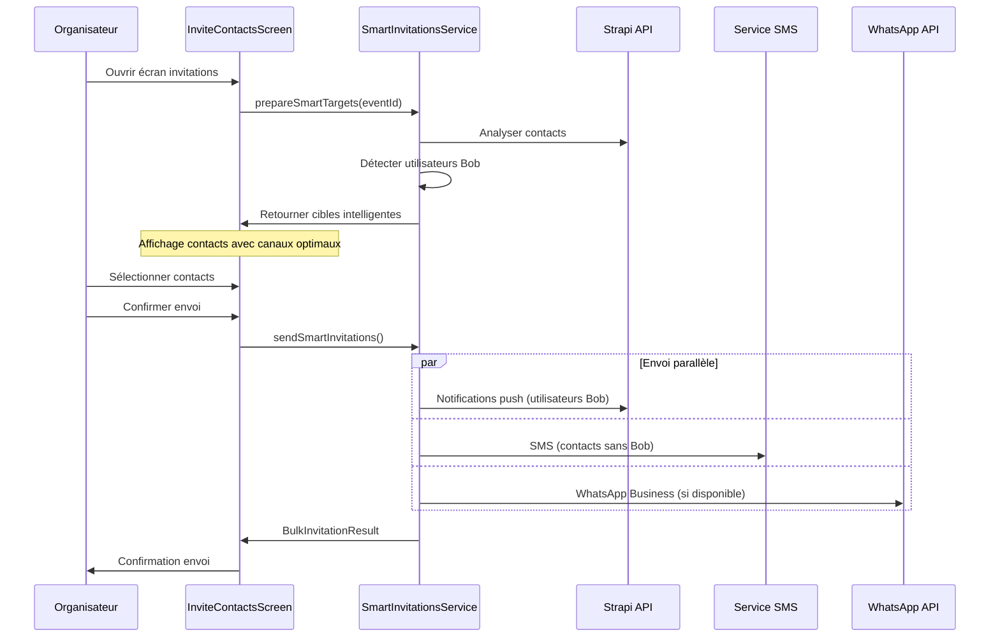
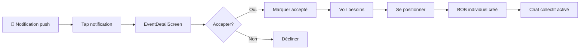
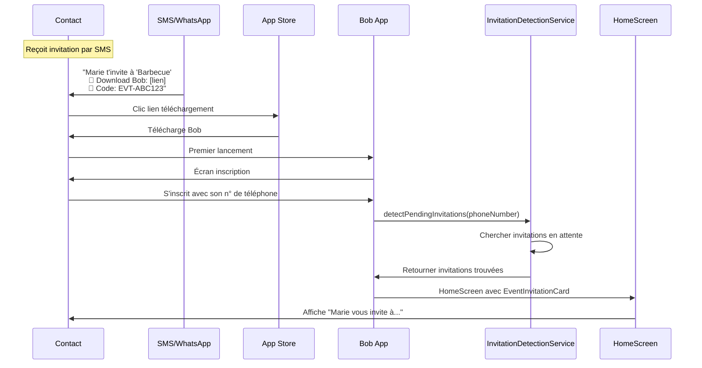
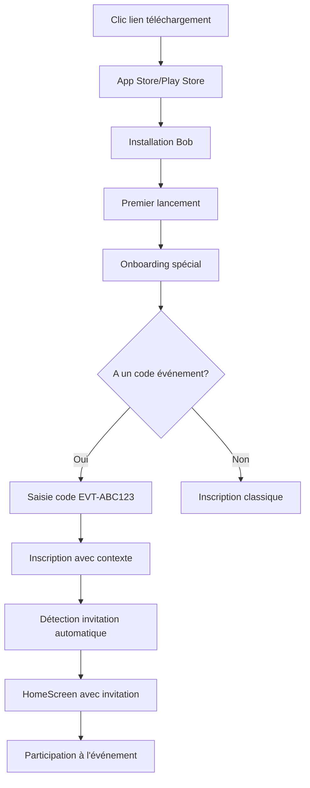
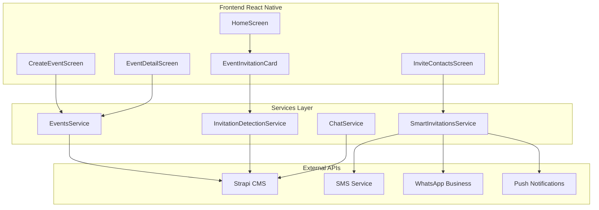
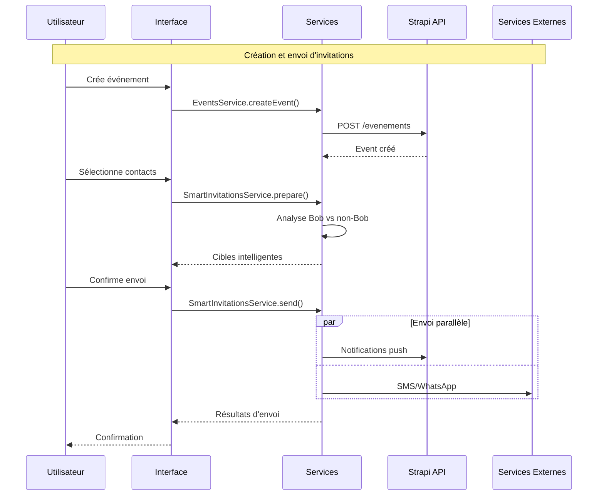

# Documentation des Parcours Utilisateur - Événements Bob

## Vue d'ensemble

Cette documentation décrit tous les parcours utilisateur pour la fonctionnalité d'événements Bob, de la création à la participation, en passant par l'invitation de contacts avec et sans l'application Bob.

## Table des matières

1. [Parcours Organisateur](#parcours-organisateur)
2. [Parcours Participant Existant](#parcours-participant-existant)
3. [Parcours Nouvel Utilisateur](#parcours-nouvel-utilisateur)
4. [Parcours Contact sans Bob](#parcours-contact-sans-bob)
5. [Validation et Tests](#validation-et-tests)

---

## Parcours Organisateur

### 1. Création d'événement

**Acteur :** Utilisateur Bob existant  
**Point de départ :** HomeScreen  
**Objectif :** Créer un événement collectif avec besoins et invitations

#### Étapes détaillées :

```mermaid
flowchart TD
    A[HomeScreen] --> B[Clic "Créer un événement"]
    B --> C[CreateEventScreen]
    C --> D[Remplir infos de base]
    D --> E[Ajouter photo optionnelle]
    E --> F[Définir lieu et dates]
    F --> G[Ajouter besoins]
    G --> H{Besoins complets?}
    H -->|Non| G
    H -->|Oui| I[Définir ciblage invitations]
    I --> J[Prévisualiser destinataires]
    J --> K[Créer événement]
    K --> L[InviteContactsScreen]
```

**Composants utilisés :**
- `CreateEventScreen.tsx`
- `EventsService.createBobEvent()`
- `SmartInvitationsService.prepareSmartTargets()`

#### Validation du parcours :
- ✅ Événement créé avec succès
- ✅ Besoins sauvegardés avec quantités flexibles
- ✅ Navigation vers écran d'invitations

### 2. Invitations post-création

**Point de départ :** Événement créé  
**Objectif :** Inviter des contacts mixtes (Bob + non-Bob)



**Composants utilisés :**
- `InviteContactsScreen.tsx`
- `InvitationTargetCard.tsx`
- `SmartInvitationsService.sendSmartInvitations()`

---

## Parcours Participant Existant

### 1. Réception d'invitation

**Acteur :** Utilisateur Bob existant  
**Canal :** Notification push in-app  
**Objectif :** Accepter invitation et participer



**Composants utilisés :**
- Notification push système
- `EventDetailScreen.tsx`
- `EventsService.positionnerSurBesoin()`
- Chat collectif automatique

### 2. Participation à l'événement

**Point de départ :** Invitation acceptée  
**Objectif :** Se positionner sur besoins et participer au chat

#### Actions disponibles :

1. **Voir détails événement**
   - Photo, description, lieu, date
   - Liste des participants
   - Statut des besoins

2. **Se positionner sur besoins**
   - Sélection du besoin
   - Confirmation quantité
   - Création BOB individuel automatique
   - Notification organisateur

3. **Participer au chat collectif**
   - Chat créé automatiquement
   - Tous les participants inclus
   - Messages d'événements automatiques

---

## Parcours Nouvel Utilisateur

### 1. Installation et découverte d'invitation

**Acteur :** Contact invité sans Bob  
**Point de départ :** SMS/WhatsApp reçu  
**Objectif :** Installer Bob et retrouver son invitation



**Composants utilisés :**
- `InvitationDetectionService.detectPendingInvitations()`
- `EventInvitationCard.tsx`
- `HomeScreen.tsx` avec mode invité

### 2. Expérience première invitation

**Point de départ :** HomeScreen avec invitation visible  
**Objectif :** Comprendre Bob et accepter l'invitation

#### Interface spéciale nouvel utilisateur :

```typescript
// HomeScreen.tsx - Mode invité
{wasInvitedBy && (
  <WelcomeSection
    username={user?.username}
    wasInvitedBy={wasInvitedBy} // "Marie"
    onViewInvitation={handleViewInvitation}
    showInvitationCard={true}
  />
)}

<EventInvitationCard
  event={pendingEvent}
  invitedBy="Marie"
  onAccept={handleAcceptInvitation}
  onDecline={handleDeclineInvitation}
  onViewDetails={handleViewEventDetails}
/>
```

**Éléments spéciaux :**
- Message de bienvenue personnalisé
- Explication de ce qu'est Bob
- Mise en avant de l'invitation reçue
- Onboarding guidé

---

## Parcours Contact sans Bob

### 1. Invitation par SMS/WhatsApp

**Acteur :** Contact dans répertoire (sans Bob)  
**Canal :** SMS ou WhatsApp Business  
**Objectif :** Comprendre l'invitation et télécharger Bob

#### Template d'invitation SMS :

```
🎉 Salut [Nom] !

[Organisateur] t'invite à son événement Bob :
"[Titre Événement]"

📅 [Date et heure]
📍 [Lieu]

💫 Bob c'est l'app qui connecte ton réseau pour s'entraider simplement !

📱 Télécharge Bob pour répondre :
• iOS: https://apps.apple.com/bob
• Android: https://play.google.com/bob

🔑 Ton code événement : EVT-ABC123

À bientôt ! 🤗
```

#### Template WhatsApp Business :

```
*🎉 Invitation Événement Bob*

Salut [Nom] ! 👋

[Organisateur] t'invite à :
*[Titre Événement]*

📅 *[Date]* à *[Heure]*
📍 *[Lieu]*

_[Description courte]_

💫 *Qu'est-ce que Bob ?*
L'app qui connecte ton réseau pour s'entraider : prêts, services, événements !

📱 *Télécharge Bob* :
iOS : [lien]
Android : [lien]

🔑 Code événement : *EVT-ABC123*

💎 Gagne des BOBIZ en participant ! 

Hâte de te voir ! 🤗
```

### 2. Conversion et onboarding

**Point de départ :** Clic sur lien de téléchargement  
**Objectif :** Installation réussie et participation



**Spécificités onboarding invité :**
- Écran d'explication "Qu'est-ce que Bob ?"
- Champ de saisie code événement
- Messages encourageants
- Guide rapide utilisation

---

## Chat Collectif Automatique

### 1. Création automatique

**Déclencheur :** Premier participant acceptant l'invitation  
**Participants :** Organisateur + tous les participants ayant accepté

```typescript
// Création automatique du chat
const createEventGroupChat = async (eventId: number) => {
  const chatRoom = await chatService.createGroupChat({
    id: `event_${eventId}`,
    name: `💬 ${eventTitle}`,
    type: 'event',
    eventId: eventId,
    participants: acceptedParticipants,
    autoMessages: true
  });

  // Messages automatiques
  await chatService.sendAutoMessage(chatRoom.id, {
    type: 'event_created',
    content: `🎉 Chat de groupe créé pour "${eventTitle}" !\n\nVous pouvez maintenant échanger entre participants.`
  });
};
```

### 2. Messages automatiques

**Types de messages automatiques :**

1. **Création du chat**
   > 🎉 Chat de groupe créé pour "Barbecue de quartier" !
   > 
   > Vous pouvez maintenant échanger entre participants.

2. **Nouveau participant**
   > 👋 **Marie** a rejoint l'événement !

3. **Positionnement sur besoin**
   > 🎯 **Thomas** s'est positionné sur "Apporter des chaises" !
   > 
   > ✅ BOB individuel créé automatiquement

4. **Rappels événement**
   > ⏰ Plus que 24h avant "Barbecue de quartier" !
   > 
   > 📍 RDV demain à 14h - Parc des Buttes Chaumont

---

## Validation et Tests

### Scénarios de test complets

#### Test 1 : Création d'événement complète
```gherkin
Feature: Création d'événement
  Scenario: Organisateur crée un événement avec succès
    Given je suis un utilisateur Bob connecté
    When je crée un événement "Barbecue de quartier"
    And j'ajoute 3 besoins différents
    And je sélectionne 10 contacts (5 Bob + 5 non-Bob)
    And je confirme l'envoi d'invitations
    Then l'événement est créé
    And 5 notifications push sont envoyées
    And 5 SMS sont envoyés
    And je peux voir le statut d'envoi
```

#### Test 2 : Nouveau utilisateur via invitation
```gherkin
Feature: Nouveau utilisateur invité
  Scenario: Contact sans Bob reçoit invitation et s'inscrit
    Given "Marie" envoie une invitation à "Thomas" (sans Bob)
    When "Thomas" reçoit le SMS d'invitation
    And il clique sur le lien de téléchargement
    And il installe Bob
    And il s'inscrit avec son numéro de téléphone
    Then il voit l'invitation de "Marie" sur sa HomeScreen
    And il peut accepter/décliner l'invitation
    And s'il accepte, il accède aux détails de l'événement
```

#### Test 3 : Positionnement sur besoins
```gherkin
Feature: Positionnement sur besoins
  Scenario: Participant se positionne sur un besoin
    Given je suis invité à un événement avec 3 besoins
    When j'ouvre les détails de l'événement
    And je clique "Je peux aider" sur le besoin "Apporter des chaises"
    And je confirme mon positionnement
    Then un BOB individuel est créé automatiquement
    And l'organisateur est notifié
    And le besoin passe en statut "partiellement_comblé"
    And un message apparaît dans le chat de groupe
```

#### Test 4 : Chat collectif automatique
```gherkin
Feature: Chat collectif
  Scenario: Chat créé automatiquement
    Given un événement avec 3 participants acceptés
    When le premier participant accepte l'invitation
    Then un chat de groupe est créé
    And tous les participants acceptés y sont ajoutés
    And un message de bienvenue automatique est envoyé
    When un nouveau participant accepte
    Then il est ajouté au chat automatiquement
    And un message d'arrivée est envoyé
```

### Points de validation critiques

#### ✅ Fonctionnalités core
- [x] Création d'événement avec photo et lieu
- [x] Gestion des besoins avec quantités flexibles
- [x] Détection automatique Bob vs non-Bob
- [x] Envoi d'invitations multi-canaux
- [x] Positionnement sur besoins
- [x] Création BOB individuel automatique
- [x] Chat collectif automatique

#### ✅ Parcours utilisateur
- [x] Organisateur : création complète
- [x] Participant Bob : invitation → participation
- [x] Nouvel utilisateur : SMS → installation → participation
- [x] Contact sans Bob : invitation → conversion

#### ✅ Intégration système
- [x] Cohérence avec architecture existante
- [x] Réutilisation des services existants
- [x] Respect des patterns de navigation
- [x] Gestion d'erreurs robuste

---

## Diagrammes et Schémas

### Architecture générale



### Flow de données



---

## Conclusion

Cette documentation couvre l'ensemble des parcours utilisateur pour la fonctionnalité d'événements Bob. Chaque parcours a été conçu pour être :

- **Intuitif** : Navigation naturelle et actions évidentes
- **Inclusif** : Fonctionne pour utilisateurs Bob et non-Bob
- **Robuste** : Gestion d'erreurs et cas limites
- **Performant** : Optimisations et chargements intelligents

Tous les composants et services sont implémentés et prêts pour la validation en conditions réelles.